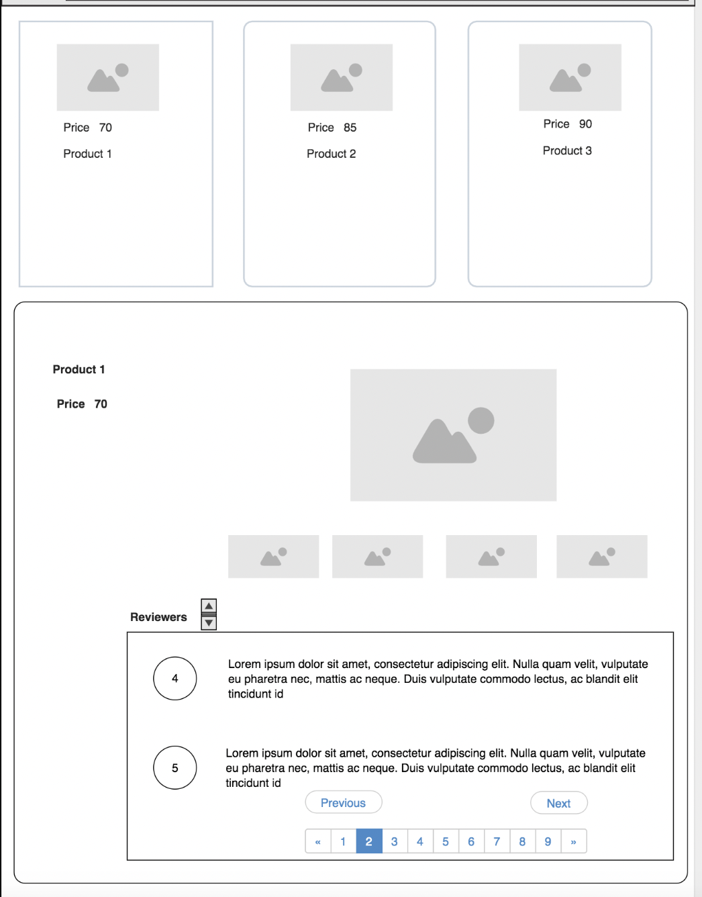

## Challenge Idea
The purpose of this task is to show your frontend skills (javascript, html, css), one page should be implemented that shows products list and the user can click on any product to get its details

## Acceptance Criteria
- The application starts with listing all products 
   http://my-json-server.typicode.com/WhatsLab/code-challenge/products
- The user can click on any product to get its details, the product details is rendered in same page "no router needed"
   http://my-json-server.typicode.com/WhatsLab/code-challenge/productDetails/{id}
- The user should find an image gallery for the product
- The user should see the comments divided into pages and each page contains 2 comments
- The user can sort comments based on comment score

## Expectations

- User React.js 
- You can use any css framework
- ECMAScript 6 and beyond must be used
- Unit testing
- No plugin should be used for pagination and image gallery
- How will the components communicate with each other ?
- Quality over quantity
- For uncompleted points please mention in the readme how you were going to implement them.

We are looking for **readability, documentation, good architectural decisions, eye for performance, modularity, and unit tested code.**

# Getting Started with Create React App

This project was bootstrapped with [Create React App](https://github.com/facebook/create-react-app), using the [Redux](https://redux.js.org/) and [Redux Toolkit](https://redux-toolkit.js.org/) TS template.

## Available Scripts

In the project directory, you can run:

### `npm start`

Runs the app in the development mode.\
Open [http://localhost:3000](http://localhost:3000) to view it in the browser.

The page will reload if you make edits.\
You will also see any lint errors in the console.

### `npm test`

Launches the test runner in the interactive watch mode.\
See the section about [running tests](https://facebook.github.io/create-react-app/docs/running-tests) for more information.

### `npm run build`

Builds the app for production to the `build` folder.\
It correctly bundles React in production mode and optimizes the build for the best performance.

The build is minified and the filenames include the hashes.\
Your app is ready to be deployed!

See the section about [deployment](https://facebook.github.io/create-react-app/docs/deployment) for more information.

### `npm run eject`

**Note: this is a one-way operation. Once you `eject`, you can’t go back!**

If you aren’t satisfied with the build tool and configuration choices, you can `eject` at any time. This command will remove the single build dependency from your project.

Instead, it will copy all the configuration files and the transitive dependencies (webpack, Babel, ESLint, etc) right into your project so you have full control over them. All of the commands except `eject` will still work, but they will point to the copied scripts so you can tweak them. At this point you’re on your own.

You don’t have to ever use `eject`. The curated feature set is suitable for small and middle deployments, and you shouldn’t feel obligated to use this feature. However we understand that this tool wouldn’t be useful if you couldn’t customize it when you are ready for it.

## Learn More

You can learn more in the [Create React App documentation](https://facebook.github.io/create-react-app/docs/getting-started).

To learn React, check out the [React documentation](https://reactjs.org/).
